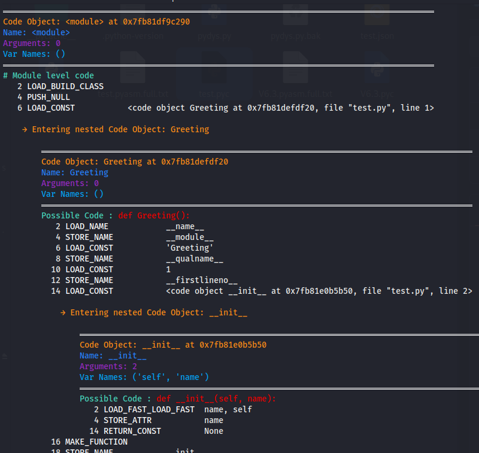

---

# 🔬 pydys - Python PYC Disassembler

**A recursive Python bytecode disassembler that penetrates nested code objects, reconstructs function signatures, and generates human-readable annotated output.**  
Supports **Python 3.8 → 3.14+**, **all opcodes**, **nested functions/classes**, **exception tables**, and **auto-requirements extraction**.  
Perfect for reverse engineering, malware analysis, CTF challenges, and understanding compiled Python code.



---

## 📑 Table of Contents

- [Features](#features)
- [Requirements](#requirements)
- [Installation](#installation)
- [Important: Python Version Compatibility](#important-python-version-compatibility)
- [Usage](#usage)
  - [Basic Commands](#basic-commands)
  - [Examples](#examples)
- [Output Overview](#output-overview)
  - [PYASM Output Format](#pyasm-output-format)
  - [Requirements.txt Output](#requirementstxt-output)
  - [JSON Output Format](#json-output-format)
- [Configuration](#configuration)
- [Internals & How It Works](#internals--how-it-works)
- [Troubleshooting](#troubleshooting)
  - [Common Issues](#common-issues)
  - [Version Mismatch](#version-mismatch)
- [Contributing](#contributing)
- [Disclaimer](#disclaimer)
- [License](#license)
- [Support](#support)
- [Links](#links)

---

## Features

- [x] **Recursive Disassembly** - Penetrates ALL nested code objects (functions, classes, methods, nested functions)
- [x] **Function Signature Reconstruction** - Extracts argument names from bytecode automatically
- [x] **Python Version Detection** - Identifies Python version from magic numbers (3.8 → 3.14+)
- [x] **Import Tracking** - Automatically lists ALL imports from the entire codebase
- [x] **Requirements.txt Generation** - Auto-detect third-party packages and generate pip requirements
- [x] **Color-Coded Output** - Visual distinction for different opcode types (jumps, imports, exceptions)
- [x] **JSON Export** - Machine-readable output for automation and parsing
- [x] **No-Color Mode** - Perfect for _CI/CD_ pipelines and log files
- [x] **Custom Output Path** - Save analysis to any file
- [x] **Clean Opcode Display** - Removes noisy modern opcodes (`CACHE`, `RESUME`, `PRECALL`)
- [x] **Exception Table Analysis** - Shows exception handling blocks
- [x] **Jump Target Labels** - Automatically labels jump targets for readability
- [x] **Nested Object Detection** - Identifies and recursively disassembles ALL nested code objects
- [x] **Multi-version Support** - Handles Python 3.8 through 3.14+ magic numbers

---

## Requirements

```
colorama>=0.4.6
```

Install via:

```bash
pip install colorama
```

**No other dependencies!** Uses only Python standard library.

---

## Installation

```bash
# Clone the repository
git clone https://github.com/bl4d3rvnner7/pydys.git
cd pydys

# Make executable
chmod +x pydys.py

# Optional: Install globally
sudo ln -s $(pwd)/pydys.py /usr/local/bin/pydys

# Install dependencies
pip install colorama
```

---

## Important: Python Version Compatibility

**You MUST use the same Python version that created the .pyc file!**

PyInstaller Unpacks always deliver the Python Version.

### Detecting the required version:

```bash
python3 pydys.py -f script.pyc --detect-version
```

Example output:
```
File: script.pyc
Magic Number: 3571
Python Version: 3.13+
Recommended Interpreter: pyenv install 3.13 && pyenv local 3.13
```

### Setting up correct Python version:

#### Linux/macOS (using pyenv):
```bash
# Install pyenv
curl https://pyenv.run | bash

# Install required version
pyenv install 3.13.0
pyenv local 3.13.0

# Run pydys
python3 pydys.py -f script.pyc
```

#### Windows:
```bash
# Using pyenv-win
pip install pyenv-win --target $HOME\pyenv-win

# Or use specific Python installation
py -3.13 -m pydys -f script.pyc

# Or use conda
conda create -n py313 python=3.13
conda activate py313
python pydys.py -f script.pyc
```

#### Docker (version-agnostic):
```bash
docker run -v $(pwd):/data python:3.13 python /usr/local/bin/pydys -f /data/script.pyc
```

---

## Usage

### Basic Commands

| Command | Description |
|---------|-------------|
| `pydys -f script.pyc` | Basic disassembly |
| `pydys -f script.pyc --detect-version` | Detect Python version only |
| `pydys -f script.pyc --requirements` | Generate requirements.txt |
| `pydys -f script.pyc --json` | JSON output for automation |
| `pydys -f script.pyc --no-color` | Plain text for logs |
| `pydys -f script.pyc -o output.txt` | Custom output file |
| `pydys -f script.pyc --modern` | Enable Python 3.11+ adaptive features |

### Examples

```bash
# Basic analysis
python3 pydys.py -f V6.3.pyc

# Detect version only
python3 pydys.py -f unknown.pyc --detect-version

# Generate requirements for dependencies
python3 pydys.py -f malware.pyc --requirements

# JSON output for parsing
python3 pydys.py -f script.pyc --json > analysis.json

# No color mode for CI/CD
python3 pydys.py -f script.pyc --no-color --output log.txt

# Full analysis with all features
python3 pydys.py -f script.pyc --json --requirements --modern
```

---

## Output Overview

### PYASM Output Format

The tool generates `.pyasm.full.txt` with this structure:

```
══════════════════════════════════════════════════════════════════════════════════════════
Code Object: <module> at 0x55eed340f200
Name: <module>
Arguments: 0
Var Names: ()
══════════════════════════════════════════════════════════════════════════════════════════
# Module level code

   2 LOAD_CONST           0
   4 LOAD_CONST           None
   6 IMPORT_NAME          bip32utils
   8 STORE_NAME           bip32utils
   
   → Entering nested Code Object: clear
   
   ══════════════════════════════════════════════════════════════════════════════════════════
   Code Object: clear at 0x55eed340c6d0
   Name: clear
   Arguments: 0
   Var Names: ()
   ══════════════════════════════════════════════════════════════════════════════════════════
   Possible Code : def clear():
   
      2 LOAD_GLOBAL          platform
     12 LOAD_ATTR            system
      ...
```

### Requirements.txt Output

When using `--requirements` flag:

```txt
# Auto-generated by pydys
# From: V6.3.pyc
# Python version: 3.13+

# Known third-party packages:
bip32utils>=0.3.0
colorama>=0.4.6
eth-account>=0.9.0
keyauth
mnemonic>=0.20
requests>=2.28.0

# Unknown packages (manual review needed):
# custom_package
```

### JSON Output Format

When using `--json` flag:

```json
{
  "magic_number": 3571,
  "python_version": "3.13+",
  "imports": [
    "bip32utils",
    "eth_account",
    "requests",
    "colorama",
    "keyauth"
  ],
  "code_objects": []
}
```

---

## Configuration

No configuration file needed! All settings are command-line flags:

| Flag | Default | Description |
|------|---------|-------------|
| `--file` | (required) | PYC file to disassemble |
| `--output` | Auto-generated | Custom output file path |
| `--no-color` | `False` | Disable colored output |
| `--json` | `False` | JSON output format |
| `--modern` | `False` | Python 3.11+ adaptive features |
| `--detect-version` | `False` | Only detect version and exit |
| `--requirements` | `False` | Extract requirements.txt |

---

## Internals & How It Works

The script:

1. **Reads PYC Header** - Extracts magic number to detect Python version
2. **Loads Code Object** - Uses `marshal.load()` to decompile the code object
3. **Recursive Disassembly** - Walks through ALL instructions using `dis.Bytecode()`
4. **Detects Nested Objects** - Identifies `LOAD_CONST` instructions containing code objects
5. **Recurses Deep** - Disassembles each nested object with increased indentation
6. **Cleans Opcodes** - Removes `+ NULL|self` and other artifacts from `LOAD_ATTR`/`LOAD_GLOBAL`
7. **Tracks Imports** - Captures all `IMPORT_NAME` and `IMPORT_FROM` instructions
8. **Generates Signatures** - Reconstructs function signatures from `co_varnames`
9. **Exports Formats** - Saves PYASM, JSON, or requirements.txt based on flags
10. **Handles Exceptions** - Preserves exception table information in output

Everything is handled inside `pydys.py` with color-coded terminal output and no external dependencies except `colorama` for cross-platform colors.

---

## Troubleshooting

### Common Issues

| Issue | Solution |
|-------|----------|
| `Marshal Error` | Wrong Python version - check with `--detect-version` |
| `File not found` | Verify path to `.pyc` file |
| `No imports detected` | File may be corrupted or not a valid PYC |
| `Weird opcodes` | Try `--modern` flag for Python 3.11+ |
| `KeyError in magic numbers` | Unsupported Python version - update `PYTHON_MAGIC_NUMBERS` |

### Version Mismatch

If you see marshal errors, you're likely using the wrong Python version:

```bash
# Check what version you need
python3 pydys.py -f script.pyc --detect-version

# Install required version with pyenv
pyenv install 3.13.0
pyenv local 3.13.0

# Try again
python3 pydys.py -f script.pyc
```

---

## Contributing

Pull requests are always welcome!

You can add:
- Support for more Python versions
- Better code object reconstruction
- Decompilation to actual Python source
- GUI interface
- Batch processing for multiple PYC files
- Performance optimizations

Please ensure your PR includes:
- Updated tests if applicable
- Updated documentation
- Follows existing code style

---

## Disclaimer

This tool is for **educational and research purposes only**. Use it to:
- Understand compiled Python code
- Learn how Python bytecode works
- Reverse engineer your own code
- Analyze malware (in sandboxed environments)
- Solve CTF challenges

The authors are not responsible for any misuse of this tool. Always respect software licenses and terms of service.

---

## License

MIT License - see [LICENSE](LICENSE) file

---

## Support

If you find this tool useful, consider leaving a **star** ⭐ on GitHub!
It motivates further updates and improvements.

---

## Links

- [Report Bug](https://github.com/bl4d3rvnner7/pydys/issues)
- [Request Feature](https://github.com/bl4d3rvnner7/pydys/issues)

